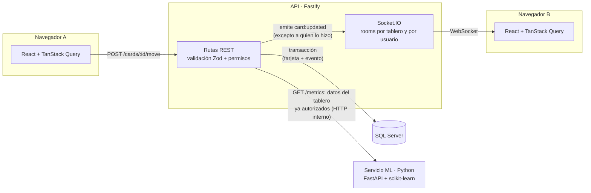
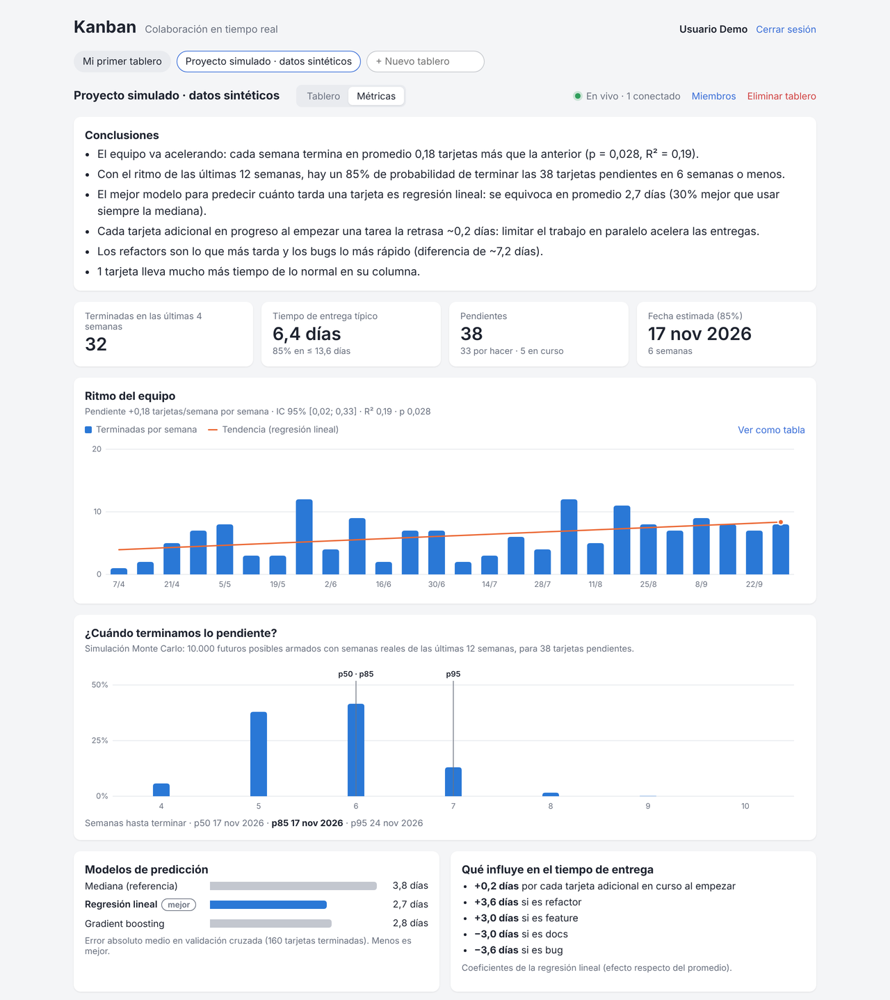
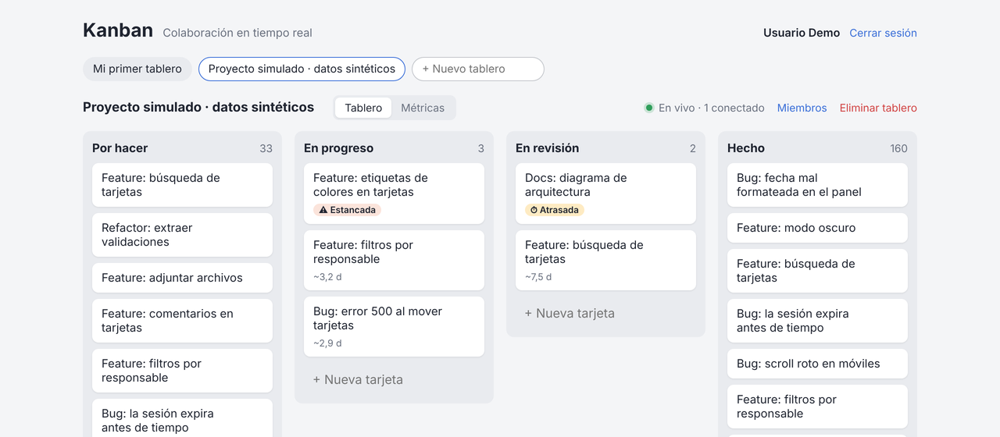
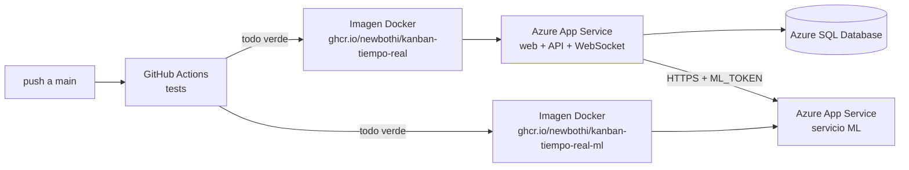

# Kanban colaborativo en tiempo real

Tablero Kanban multiusuario: varias personas trabajan en el mismo tablero y ven los cambios de los demás al instante, sin recargar. Incluye cuentas de usuario, tableros compartidos con roles y permisos validados tanto en la API como en el canal en tiempo real, y un **servicio de análisis en Python** (regresión, simulación Monte Carlo y modelos de machine learning) que pronostica entregas y detecta tarjetas estancadas.


**Demo en vivo:** https://kanban-newbothi.azurewebsites.net<br>
Usuario demo: `demo@kanban.cl` / `demo1234`. También puedes crear tu cuenta y abrir la demo en dos navegadores para ver la sincronización.

> Está alojada en niveles gratuitos de Azure: si nadie la usa por un rato, la primera carga puede tardar entre 30 y 60 segundos mientras despiertan el servidor y la base de datos.


<table>
  <tr>
    <td></td>
    <td></td>
  </tr>
</table>

## Funcionalidades

- **Arrastrar y soltar** tarjetas entre columnas y dentro de una columna, con teclado accesible.
- **Tiempo real:** crear, mover y eliminar tarjetas se refleja al instante en los demás navegadores.
- **Presencia:** cuántas personas están viendo el tablero.
- **Cuentas y sesiones** con JWT en cookie `httpOnly`.
- **Tableros compartidos:** el dueño invita por correo y quita miembros. Quien pierde el acceso es expulsado del canal en vivo en ese mismo momento.
- **Actualizaciones optimistas:** la interfaz responde sin esperar al servidor y se revierte si la operación falla.
- **Reconexión automática:** si se corta la conexión, el cliente se reconecta y se resincroniza.
- **Métricas con ML (Python):** tendencia del ritmo del equipo, fecha estimada de entrega con simulación Monte Carlo, predicción del tiempo de cada tarjeta y detección de tarjetas estancadas. Se recalculan solas cuando alguien mueve una tarjeta.

## Stack

| Capa | Tecnologías |
|---|---|
| Front | React 19, TypeScript, Vite, dnd-kit, TanStack Query |
| API | Node.js, Fastify 5, Socket.IO, Zod |
| Datos | SQL Server, Prisma 7 (driver adapter `mssql`) |
| Análisis (ML) | Python 3.13, FastAPI, scikit-learn, SciPy, NumPy |
| Seguridad | JWT en cookie httpOnly, bcrypt, rate limiting |
| Tests | Vitest (unitarios e integración), pytest, Playwright (E2E con dos navegadores) |
| CI | GitHub Actions con SQL Server como servicio |

## Arquitectura



Es un **monorepo** con npm workspaces:

```
apps/
  web/        Front (React)
  api/        API REST + Socket.IO
  ml/         Servicio de análisis (Python + FastAPI)
packages/
  shared/     Tipos, schemas Zod, eventos del socket y lógica de orden.
              Los usan el front y la API: un solo contrato, verificado por TypeScript.
```

## Decisiones técnicas

**Los cambios entran por REST; el WebSocket solo avisa.** La validación, los permisos y las transacciones quedan en un solo lugar. Después de guardar, la API emite el evento a la room del tablero, excluyendo al socket que hizo el cambio, que se identifica con el header `x-socket-id`.

**Orden con *fractional indexing*.** Cada tarjeta tiene una `position` tipo string (`a0`, `a0V`, `a1`…). Mover una tarjeta genera una clave entre sus vecinas, así que **solo se actualiza una fila**, sin renumerar el resto. Eso hace que cada movimiento sea un único evento pequeño.

**Collation binaria en SQL Server.** Esas claves deben ordenarse byte a byte, pero la collation por defecto de SQL Server no distingue mayúsculas y desordenaría las tarjetas en silencio. La columna `position` usa `COLLATE Latin1_General_BIN2`. Prisma no permite declarar collations, así que la migración está ajustada a mano.

**El cliente envía "columna + índice", no la `position`.** El servidor calcula la clave definitiva dentro de una transacción. El front usa **la misma función** (`positionForMove`, en `packages/shared`) para la actualización optimista, de modo que lo que se ve y lo que se guarda coinciden. Un test lo verifica.

**Un solo request por arrastre.** Mientras se arrastra, el front trabaja sobre una copia local. Al soltar, envía un único `move`.

## Análisis con machine learning (Python)



**Cómo encaja.** El servicio de Python no tiene base de datos ni credenciales, y no está expuesto al navegador. La API de Node verifica que el usuario sea miembro del tablero, reúne sus datos y se los envía. Python solo calcula y responde. Así:

- Los permisos viven en un solo lugar.
- Python no necesita drivers de SQL Server.
- El servicio no tiene estado, así que se pueden levantar varias copias sin coordinar nada.

En producción, además, exige un secreto compartido (`ML_TOKEN`). Si el servicio se cae, el tablero sigue funcionando y la pestaña de métricas muestra un aviso.

**Contrato tipado entre lenguajes.** Los modelos de Pydantic generan el esquema OpenAPI, y a partir de él se generan los tipos de TypeScript (`packages/shared/src/ml-api.ts`, con `npm run ml:types`). El CI regenera ambos y falla si no coinciden con los commiteados, así que no se puede cambiar la API de Python sin que TypeScript se entere.

**Los datos.** Cada cambio de columna se guarda en `CardEvent`, en la misma transacción que el movimiento. Ese historial es la materia prima del análisis.

| Análisis | Método | Qué responde |
|---|---|---|
| Ritmo del equipo | Regresión lineal (SciPy) con IC 95% y p-value | ¿Terminamos más o menos tarjetas por semana? ¿Es significativo? |
| Fecha de entrega | Simulación Monte Carlo (10.000 escenarios con semanas reales) | ¿Con qué probabilidad terminamos lo pendiente en N semanas? |
| Tiempo por tarjeta | Mediana vs. regresión lineal vs. gradient boosting, con validación cruzada (MAE) | ¿Cuánto le falta a cada tarjeta? ¿Qué la retrasa? |
| Tarjetas estancadas | Regla del rango intercuartil (Q3 + 1,5·IQR) por columna | ¿Qué lleva mucho más de lo normal en curso? |

El modelo de tiempos usa como variables el tipo de tarea, el largo del título y el **trabajo en curso al empezar** (ley de Little). Se reportan los coeficientes del modelo lineal ("cada tarjeta extra en paralelo agrega X días") porque la idea es explicar, no solo predecir.

**Datos sintéticos.** Un tablero nuevo no tiene historial suficiente, así que `npm run db:simulate -w @kanban/api` genera 6 meses simulados de un equipo, con reglas conocidas:

- El ritmo crece levemente con el tiempo.
- Cada tipo de tarea tiene su propia duración.
- La multitarea alarga las entregas.
- Algunas tarjetas se bloquean.

Los tests de Python verifican que los modelos **recuperan** relaciones conocidas. Por ejemplo, si la regla es +1 día por cada tarjeta en paralelo, el coeficiente estimado debe acercarse a 1.



## Seguridad

- **Sesión:** JWT en cookie `httpOnly` (inaccesible desde JavaScript, protege contra XSS), `SameSite=Lax` (protege contra CSRF) y `Secure` en producción.
- **Contraseñas:** bcrypt con 12 rondas, limitadas a 72 bytes (lo que bcrypt realmente considera).
- **Fuerza bruta:** rate limit de 10 intentos por minuto por IP en login y registro.
- **Sin enumeración de usuarios:** si el correo no existe, el login responde con el mismo mensaje y en el mismo tiempo que con una contraseña incorrecta.
- **Autorización por tablero:**

  | Acción | Dueño | Miembro | No miembro |
  |---|:-:|:-:|:-:|
  | Ver tablero y trabajar con tarjetas | ✔ | ✔ | 404 |
  | Invitar / quitar miembros | ✔ | 403 | 404 |
  | Eliminar el tablero | ✔ | 403 | 404 |

  A quien no es miembro se le responde **404 y no 403**, para no revelar que el tablero existe. También se valida que una tarjeta no pueda moverse a una columna de **otro** tablero.
- **Tiempo real:** el handshake de Socket.IO exige una sesión válida, y `board:join` exige ser miembro. Al quitar a alguien, se sacan de la room **todas sus pestañas abiertas**.
- **Dependencias:** `npm audit` reporta 4 avisos moderados en la cadena `mssql → tedious → sprintf-js`, sin versión corregida. `tedious` solo llama a `sprintf` con formatos fijos, así que no es explotable desde las entradas de la app. El resto se corrigió con `overrides`.

## Tests

| Suite | Qué cubre | Comando |
|---|---|---|
| Unitarios (27) | Orden, movimientos, schemas | `npm run test:unit` |
| Integración (42) | Auth, permisos, eventos del socket, historial y endpoint de métricas, contra SQL Server real | `npm run test:api` |
| Python (23) | Cada análisis contra datos con propiedades conocidas, y la API de FastAPI | `python -m pytest` (en `apps/ml`) |
| E2E (2) | Dos usuarios en navegadores separados: invitar, arrastrar, sincronizar, ver métricas y expulsar | `npm run test:e2e` |

Los tests de integración comprueban, por ejemplo, que un usuario sin permisos no pueda **mover, renombrar ni borrar** tarjetas ajenas, que no pueda escuchar eventos de un tablero ajeno, y que deje de recibirlos apenas lo quitan.

## Cómo correrlo

**Requisitos:** Node.js 20.19 o superior, Python 3.12 o superior, y SQL Server con autenticación SQL y TCP habilitado en el puerto 1433.

### 1. Base de datos

En SSMS:

```sql
CREATE DATABASE kanban;
CREATE DATABASE kanban_test;   -- solo para los tests
GO
CREATE LOGIN kanban_app WITH PASSWORD = 'CambiaEsto123!', CHECK_POLICY = OFF;
GO
USE kanban;      CREATE USER kanban_app FOR LOGIN kanban_app; ALTER ROLE db_owner ADD MEMBER kanban_app;
GO
USE kanban_test; CREATE USER kanban_app FOR LOGIN kanban_app; ALTER ROLE db_owner ADD MEMBER kanban_app;
GO
```

### 2. Instalar y configurar

```bash
npm install
cd apps/api
cp .env.example .env              # en Windows: copy .env.example .env
cp .env.test.example .env.test    # en Windows: copy .env.test.example .env.test
```

En `.env`, reemplaza `JWT_SECRET` por un valor aleatorio:

```bash
node -e "console.log(require('crypto').randomBytes(48).toString('base64url'))"
```

```bash
npm run db:generate
npm run db:deploy
npm run db:seed        # usuario demo: demo@kanban.cl / demo1234
npm run db:simulate    # tablero con 6 meses de historia simulada (para las métricas)
```

Servicio de análisis (Python), desde la raíz:

```bash
cd apps/ml
python -m venv .venv
.venv\Scripts\activate          # en macOS/Linux: source .venv/bin/activate
pip install -r requirements-dev.txt
```

### 3. Desarrollo

En tres terminales:

```bash
npm run dev:api                                   # http://localhost:3000
npm run dev:web                                   # http://localhost:5173
# en apps/ml, con el entorno virtual activado:
uvicorn app.main:app --reload --port 8000         # http://localhost:8000/docs
```

FastAPI publica documentación interactiva de la API en `/docs`.

### 4. Producción

```bash
npm run build          # compila el front
npm start              # la API sirve la API, el WebSocket y el front en un solo puerto
```

En el hosting hay que definir `NODE_ENV=production`, `DATABASE_URL` y `JWT_SECRET`, y ejecutar `npm run db:deploy -w @kanban/api` antes de arrancar.

## Despliegue (Docker + Azure)



- El `Dockerfile` es multi-etapa: compila el front, genera Prisma y deja solo las dependencias de producción. Corre como usuario sin privilegios.
- El CI publica la imagen **solo si pasan todos los tests**.
- Azure App Service ejecuta el contenedor, que sirve la web, la API y el WebSocket en un único origen, así que no hace falta CORS y la cookie `Secure` funciona sobre HTTPS.
- Variables de la app principal: `DATABASE_URL`, `JWT_SECRET`, `NODE_ENV=production`, `WEBSITES_PORT=3000`, `ML_URL` y `ML_TOKEN`.
- Variables del servicio ML: `ML_TOKEN` (el mismo valor) y `WEBSITES_PORT=8000`.
- Ante errores internos, el cliente recibe un mensaje genérico. El detalle queda solo en el log.

## Estructura

```
apps/api/
  prisma/              schema, migraciones y seed
  src/app.ts           arma la app (rutas, auth, Socket.IO, archivos estáticos)
  src/auth/            sesión, login/registro y control de acceso
  src/routes/          tableros, miembros, tarjetas y métricas
  src/ml/client.ts     cliente HTTP del servicio ML
  src/realtime.ts      Socket.IO: autenticación, rooms y presencia
  test/                tests de integración
apps/ml/
  app/schemas.py       contrato (Pydantic → OpenAPI → TypeScript)
  app/analysis/        throughput, tendencia, Monte Carlo, tiempos, estancadas
  app/service.py       orquesta los análisis y redacta las conclusiones
  tests/               pytest con datos de propiedades conocidas
apps/web/
  src/api/             cliente HTTP y hooks de TanStack Query
  src/realtime/        socket y suscripción a eventos
  src/components/      tablero, columnas, tarjetas, login, miembros
  src/components/metrics/  panel de métricas y gráficos SVG
  e2e/                 tests de Playwright
packages/shared/       contrato compartido + tests unitarios
```

## Licencia

MIT. Ver [LICENSE](LICENSE).
